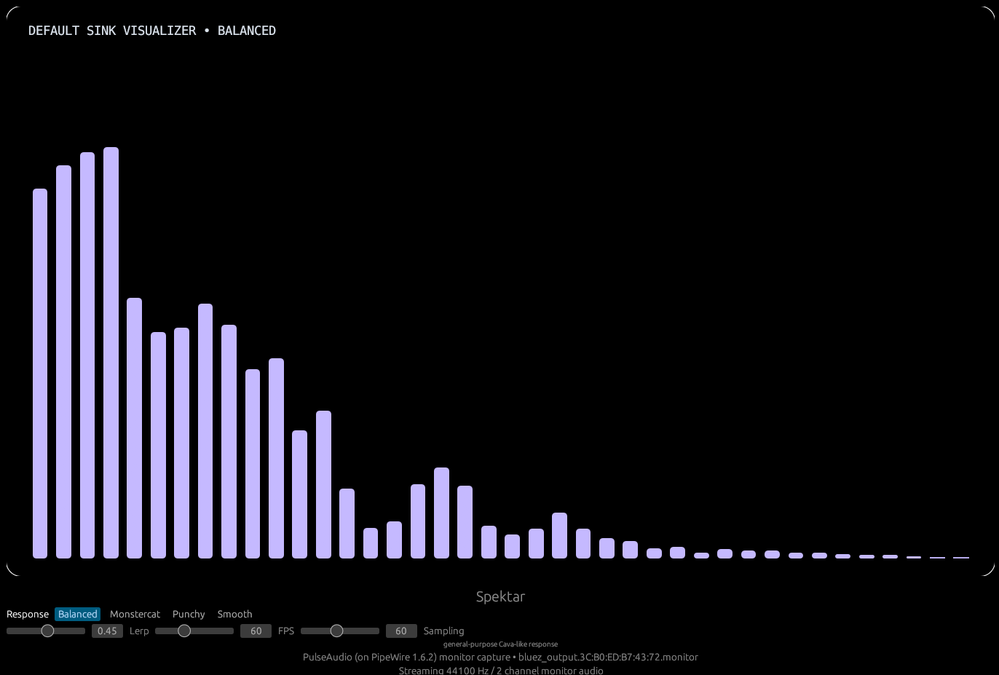

# Spektar

<p align="center">
  
</p>

Spektar is a small learning project inspired by [Cava](https://github.com/karlstav/cava).

The goal was simple: learn how to capture system audio in Rust, turn it into bars, and build a desktop visualizer around it.

## Screenshot



## What it does

- listens to the default audio output on Linux
- turns that audio into a bar visualizer
- lets you tweak the feel with presets, lerp, FPS, and update-rate controls

## A few simple ideas used in the app

- **FFT / spectrum analysis**: converts audio samples into frequency energy
- **log-style band mapping**: groups frequencies into bars in a way that feels more natural for music
- **autosensitivity**: adjusts the bar scale so everything is not always too small or too clipped
- **smoothing / lerp**: blends old and new values so the bars move more nicely

## Inspired by Cava

This project is inspired by [Cava](https://github.com/karlstav/cava)'s approach to audio visualization, but is built from scratch in Rust using egui for the UI and libpulse for audio capture.

## Running it

### Requirements

- Rust (1.70+)
- PulseAudio or PipeWire with Pulse compatibility
- Linux windowing libraries (xcb, fontconfig, etc.)

### With Nix/direnv

```bash
direnv allow
cargo run
```

### Without Nix

```bash
cargo run
```

## License

MIT
